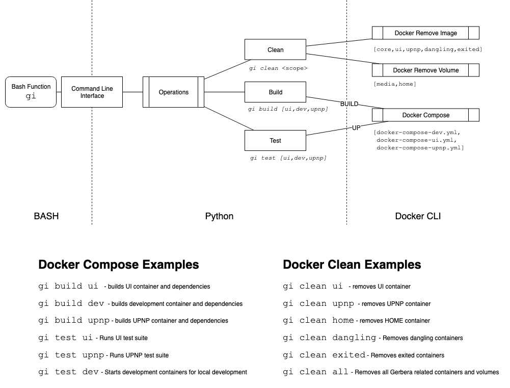

# Gerbera Integration CLI

A python based CLI exists to allow for fast use of the Gerbera Integration suite.



## Setup the BASH variables & function

1. Add the `GI_HOME` environment variable pointing to the **gerbera-integration** directory
2. Add the `gi` function to your `.bash_profile`

    **.bash_profile**
    ```bash
    export GI_HOME=/home/gerbera-integration
    gi () {
        python $GI_HOME/tools/gerbera-cli.py "$@"
    }
    ```


## Commands

### Cleanup Docker Containers

Cleanup **all** integration items

```bash
$ gi clean all
```

Cleanup the **gerbera** containers

```bash
$ gi clean ui
$ gi clean core
$ gi clean media
$ gi clean home
$ gi clean upnp
```

Cleanup the docker containers

```bash
$ gi clean exited
$ gi clean dangling
```

Compose Docker Containers
---------------------------------

#### Build the Gerbera DEV containers
_Includes_
* gerbera-core
* gerbera-home
* gerbera-media
* selenium-hub
* chrome

```bash
$ gi build dev
```

Run the Gerbera DEV containers
> This will run forever

```bash
$ gi test dev
```
---------------------------------
#### Build the Gerbera UI containers
_Includes_
* gerbera-core
* gerbera-home
* gerbera-media
* gerbera-ui
* selenium-hub
* chrome

```bash
$ gi build ui
```

Run the Gerbera ui containers
> This will run the UI test suite and exit

```bash
$ gi test ui
```
---------------------------------
#### Build the Gerbera UPNP container
_Includes_
* gerbera-core
* gerbera-home
* gerbera-media
* gerbera-upnp

```bash
$ gi build upnp
```

Run the Gerbera UPNP container
> This will run the UPNP test suite and exit

```bash
$ gi test upnp
```