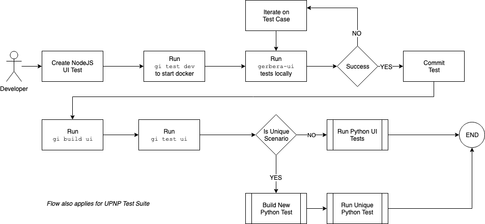

## Local Development

### Building a Test Case



The `docker-compose.dev.yml` runs the **gerbera-core**, **selenium-hub**, and **chrome-node** to allow a developer to test
the **gerbera-core** and develop additional integration tests.

```
$ docker-compose -f docker-compose.dev.yml build
$ docker-compose -f docker-compose.dev.yml up
```

> Try using the [Gerbera CLI](cli.md) ---> `gi test dev`

## Access the Gerbera UI

The containers startup in development and expose the UI interface
to the localhost runtime.

> The **gerbera-core** exposes the container port for the UI

### [http://localhost:49152/](http://localhost:49152/)


## Run the UI Test Suite

The development containers run a selenium hub and chrome node and expose the
selenium server to the localhost environment.

> You can run the UI test suite locally, but access the containers running in docker.

1. Starting from `/gerbera-ui`
2. Run `npm install` to install the UI test suite node modules
3. Setup the environment variables for the Selenium server running in docker container (_which is exposed to localhost_)
    ```
    $ export HUB_HOST=localhost
    $ export HUB_PORT=4444
    ```
4. Setup the Gerbera UI base URL
    The selenium server communicates with the **gerbera-core** over the docker network and therefore you must identify the internal
    IP address of the **gerbera-core** to set the `GERBERA_BASE_URL` value.
    
    ```
    $ docker inspect gerbera-core | jq -r '.[0].NetworkSettings.Networks | to_entries[] | .value.IPAddress'
        172.18.0.5
    $ export GERBERA_BASE_URL=http://172.18.0.5:49152
    ```
5. Run the test suite 
    ```
    $ npm run test
    ```