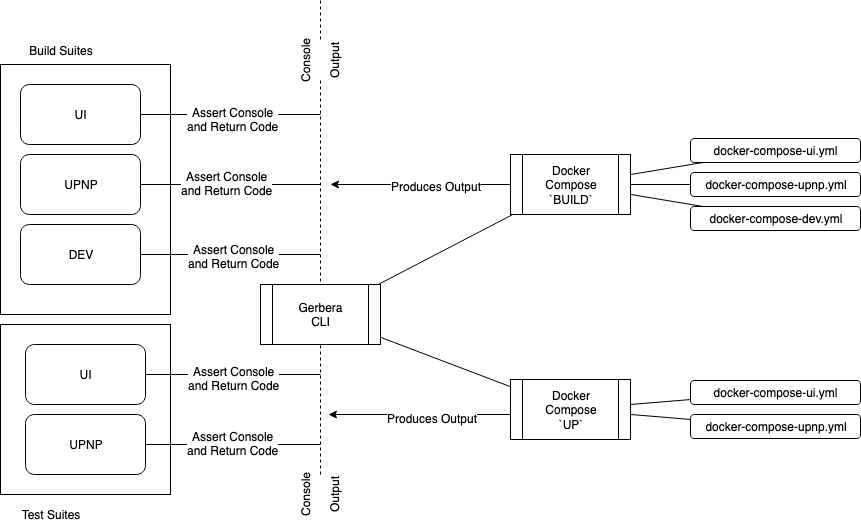

# gerbera-integration
Automated Integration Tests for Gerbera Media Server is build as separate Docker containers that can be started
separately or integrated using _docker-compose_.  
Below is documentation of the various use cases for the Gerbera Integration Suite.

#### [UI Test Suite](ui.md)  
> Automatically test Gerbera Media Server and its User Interface

#### [UPNP Test Suite](upnp.md)  
> Automatically test Gerbera Media Server and its UPNP Communication

#### [Local Development](dev.md)  
> Run all containers and interact with runtime for local development
  
#### [Containers - In Depth](containers.md)  
> Detailed look at the containers for Gerbera Integration

#### [Gerbera Integration CLI](cli.md)
> Using the `gi` command line to build and run **gerbera-integration**

### Python Test Suite
The project contains a set of python tests which run the Gerbera Integration CLI to build the 
various containers and confirm they operate with the compiled source code.

To run the test suite execute the following command from the root project directory.

```bash
$ python -m unittest discover -s ./test
```

#### Python Test Suite Design



